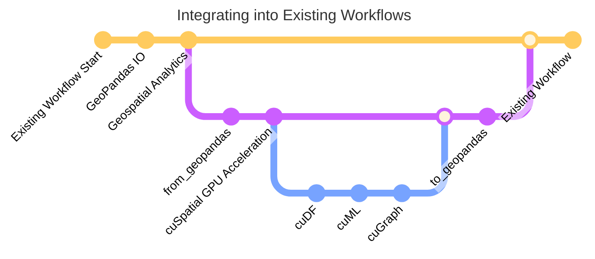

# <div align="left">&nbsp;cuSpatial - GPU-Accelerated Vector Geospatial Data Analysis</div>

> **Note** 
> 
> cuSpatial depends on [cuDF](https://github.com/rapidsai/cudf) and [RMM](https://github.com/rapidsai/rmm) from [RAPIDS](https://rapids.ai/).

## Resources

- [cuSpatial User's Guide](https://docs.rapids.ai/api/cuspatial/stable/user_guide/cuspatial_api_examples.html): Python API reference and guides
- [cuSpatial Developer Documentation](https://docs.rapids.ai/api/cuspatial/stable/developer_guide/index.html): Understand cuSpatial's architecture
- [Getting Started](https://rapids.ai/start.html): Instructions for installing cuSpatial
- [cuSpatial Community](https://github.com/rapidsai/cuspatial/discussions): Get help, collaborate, and ask the team questions
- [cuSpatial Issues](https://github.com/rapidsai/cuspatial/issues/new/choose): Request a feature/documentation or report a bug
- [cuSpatial Roadmap](https://github.com/orgs/rapidsai/projects/41/views/5): Report issues or request features.

## Overview
Now based on the [GeoArrow](https://github.com/geoarrow/geoarrow) format, cuSpatial accelerates vector geospatial operations through GPU parallelization. As part of the RAPIDS libraries, it's inherently connected to [cuDF](https://github.com/rapidsai/cudf), [cuML](https://github.com/rapidsai/cuml), and [cuGraph](https://github.com/rapidsai/cugraph), enabling GPU acceleration across entire workflows. 

cuSpatial's Python API is closely matched to GeoPandas and data can seamlessly transition between the two:
```python
import geopandas
from shapely.geometry import Polygon
import cuspatial

p1 = Polygon([(0, 0), (1, 0), (1, 1)])
p2 = Polygon([(0, 0), (1, 0), (1, 1), (0, 1)])
geoseries = geopandas.GeoSeries([p1, p2])

cuspatial_geoseries = cuspatial.from_geopandas(geoseries)
print(cuspatial_g)
```
Output:
```
0    POLYGON ((0 0, 1 0, 1 1, 0 0))
1    POLYGON ((0 0, 1 0, 1 1, 0 1, 0 0))
```

For additional examples, browse our complete [API documentation](https://docs.rapids.ai/api/cuspatial/stable/), or check out our more detailed [notebooks](https://github.com/rapidsai/notebooks-contrib) - the NYC Taxi and Weather notebooks make use of cuSpatial.

## Supported Geospatial Operations

cuSpatial is constantly working on new features! Check out the [epics](https://github.com/orgs/rapidsai/projects/41/views/4) for a high-level view of our development, or the [roadmap](https://github.com/orgs/rapidsai/projects/41/views/5) for the details!

### Core Spatial Functions
- DE9-IM Functionality [Follow Along!](https://github.com/rapidsai/cuspatial/milestone/5)
  - contains_properly
- ST_Distance equivalent functionality [Follow Along!](https://github.com/rapidsai/cuspatial/issues/767)
  - Pairwise linestring distance
  - Point to linestring distance
- Linestring-linestring intersection
- Haversine distance
- Hausdorff distance
- Spatial window filtering

### Indexing and Join Functions
- Quadtree indexing
- Spatial joins
- Quadtree-based point-to-polygon

### Trajectory Functions
- Deriving trajectories from point location data
- Computing distance/speed of trajectories
- Computing spatial bounding boxes of trajectories

### What if operations I need aren't supported?
Thanks to the `from_geopandas` and `to_geopandas` functions you can accelerate what cuSpatial supports, and leave the rest of the workflow in place:




## Using cuSpatial
**CUDA/GPU requirements**
```
CUDA 11.2+
NVIDIA driver 450.80.02+
Pascal architecture or better (Compute Capability >=6.0)
```

### Quickstart - Docker
Use the [RAPIDS Release Selector](https://rapids.ai/start.html#get-rapids), selecting `Docker` as the installation method. All RAPIDS Docker images contain cuSpatial.

```shell
docker pull nvcr.io/nvidia/rapidsai/rapidsai-core:23.02-cuda11.8-runtime-ubuntu22.04-py3.10
docker run --gpus all --rm -it \
    --shm-size=1g --ulimit memlock=-1 --ulimit stack=67108864 \
    -p 8888:8888 -p 8787:8787 -p 8786:8786 \
    nvcr.io/nvidia/rapidsai/rapidsai-core:23.02-cuda11.8-runtime-ubuntu22.04-py3.10
```

### Install from Conda

To install via conda:
> **Note** cuSpatial is supported only on Linux or [through WSL](https://rapids.ai/wsl2.html), and with Python versions 3.8 and later

cuSpatial can be installed with conda (miniconda, or the full Anaconda distribution) from the rapidsai channel:

```shell
conda install -c rapidsai -c conda-forge -c nvidia \
    cuspatial=23.04 python=3.10 cudatoolkit=11.8
```
We also provide nightly Conda packages built from the HEAD of our latest development branch.

See the [RAPIDS release selector](https://rapids.ai/start.html#get-rapids) for more OS and version info.

### Install from Source

To build and install cuSpatial from source please see the [developer documentation](https://docs.rapids.ai/api/cuspatial/stable/developer_guide/development_environment.html).

> **Warning**
> I'd like to make the install from source part of the developer docs instead of having it here. Most users will not use this method.
>#### Pre-requisite
>
>- gcc >= 7.5
>- cmake >= 3.23
>- miniconda
>
>#### Fetch cuSpatial repository
>
>```shell
>export `CUSPATIAL_HOME=$(pwd)/cuspatial` && \
>git clone https://github.com/rapidsai/cuspatial.git $CUSPATIAL_HOME
>```
>#### Install dependencies
>
>1. `export CUSPATIAL_HOME=$(pwd)/cuspatial`
>2. clone the cuSpatial repo
>
>```shell
>conda env update --file conda/environments/all_cuda-115_arch-x86_64.yaml
>```
>
>#### Build and install cuSpatial
>
>1. Compile and install
>   ```shell
>   cd $CUSPATIAL_HOME && \
>   chmod +x ./build.sh && \
>  ./build.sh
>   ```
>
>2. Run C++/Python test code
>
>   Some tests using inline data can be run directly, e.g.:
>
>   ```shell
>   $CUSPATIAL_HOME/cpp/build/gtests/LEGACY_HAUSDORFF_TEST
>   $CUSPATIAL_HOME/cpp/build/gtests/POINT_IN_POLYGON_TEST
>   python python/cuspatial/cuspatial/tests/legacy/test_hausdorff_distance.py
>   python python/cuspatial/cuspatial/tests/test_pip.py
>   ```
>
>   Some other tests involve I/O from data files under `$CUSPATIAL_HOME/test_fixtures`.
>   For example, `$CUSPATIAL_HOME/cpp/build/gtests/SHAPEFILE_READER_TEST` requires three
>   pre-generated polygon shapefiles that contain 0, 1 and 2 polygons, respectively. They are available at
>   `$CUSPATIAL_HOME/test_fixtures/shapefiles` <br>
